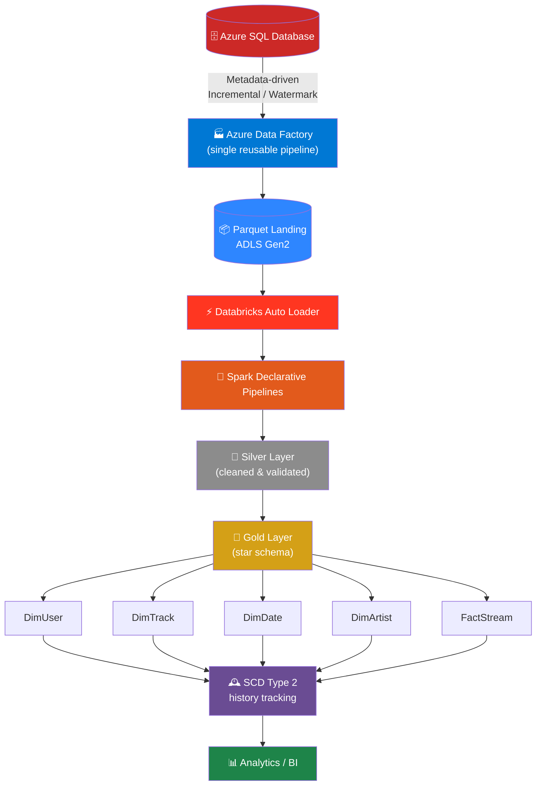
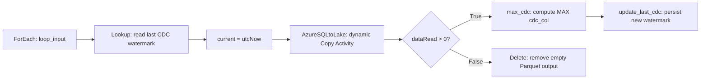
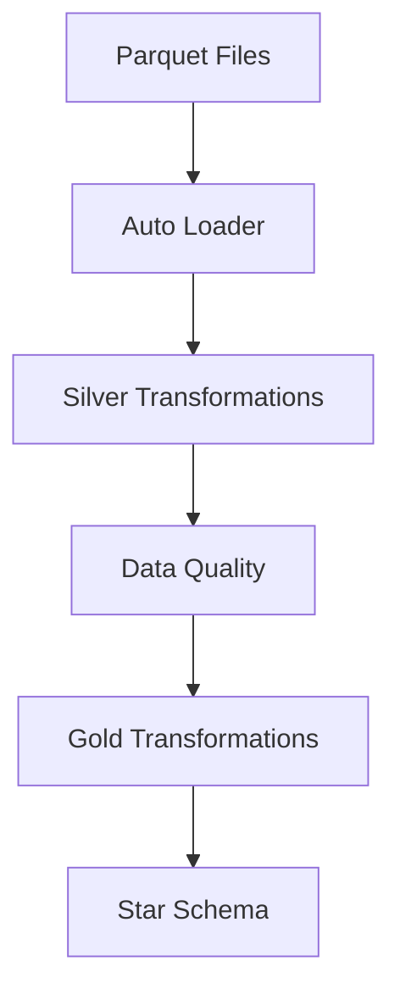
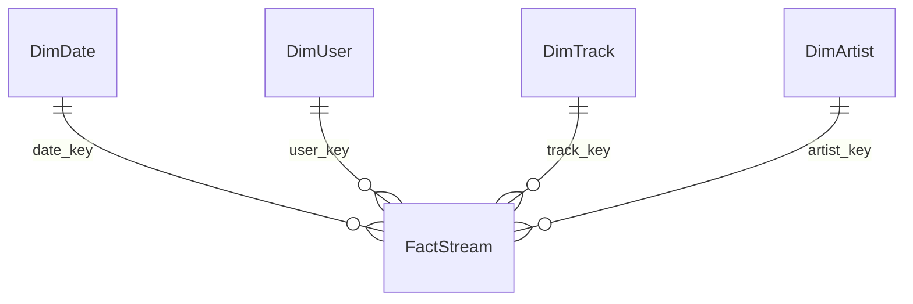
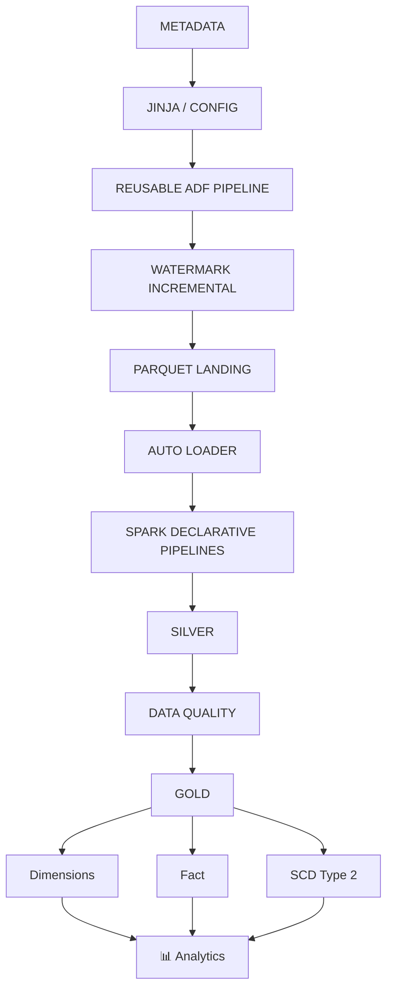

<div align="center">
<!-- Banner -->

<!-- Badges -->
<p>
  
  
  
  
  
  
  
  
  
  
  
  
</p>
<!-- Stats -->
<p>
  
  
  
  
  
  
</p>
</div>

## 📌 Overview

This is a **production-oriented, metadata-driven data engineering pipeline** on Azure. It performs **scheduled batch, incremental extraction** (not real-time streaming) of operational data from **Azure SQL Database**, lands it as **Parquet in ADLS Gen2**, and transforms it through a **Databricks Lakehouse (Bronze → Silver → Gold)** into an analytics-ready **star schema**, with full historical tracking via **SCD Type 2**.

The defining principle of the project is **metadata-driven pipeline engineering**: rather than building one Azure Data Factory pipeline per source table, a single reusable pipeline receives table-specific metadata through a parameterized array. A `ForEach` activity iterates through that metadata and dynamically builds the source query, target path, CDC/watermark logic, and processing behavior for every table.

The project currently processes five tables: `DimUser`, `DimTrack`, `DimDate`, `DimArtist`, `FactStream`.

---

## 🎯 Business Problem This Solves

Operational systems accumulate large volumes of transactional/event data that analysts need turned into trustworthy, historically-aware reporting — but naive approaches don't scale:

- ❌ Re-scanning entire source tables on every run wastes compute and puts load on production databases
- ❌ Building and maintaining a dedicated ADF pipeline per table doesn't scale as new tables are added
- ❌ Overwriting dimension records on update destroys the ability to analyze "how things looked at the time"
- ❌ Untrusted or malformed records reaching dashboards erodes confidence in the data
- ❌ Manual, undocumented deployments make environments hard to reproduce or audit

**This project solves that** by combining:

1. A **single, config-driven ADF pipeline** that onboards new tables via metadata instead of new pipeline code
2. **Watermark/CDC-based incremental extraction**, so only changed rows move at all
3. A **governed medallion lakehouse** (Bronze/Silver/Gold) with embedded **data quality** gates
4. **Dimensional (star-schema) modeling** with **SCD Type 2** for full historical accuracy
5. **Infrastructure-as-code deployment** via Databricks Asset Bundles, so environments are reproducible and auditable

The result is a reusable, scalable, and maintainable ingestion-to-analytics platform rather than a collection of one-off pipelines.

---

## 🏗️ Architecture




**Major components:**

| # | Component | Role |
|---|---|---|
| 1 | Azure SQL Database | Operational / source data |
| 2 | Azure Data Factory | Metadata-driven orchestration & incremental ingestion |
| 3 | Parquet Lake Landing | Durable staging for extracted data |
| 4 | Databricks Auto Loader | Incremental file discovery |
| 5 | Spark Declarative Pipelines | Managed, dependency-aware transformation pipeline |
| 6 | Silver Layer | Cleaned, validated datasets |
| 7 | Gold Layer | Analytical star schema |
| 8 | SCD Type 2 | Historical dimension tracking |
| 9 | Data Quality | Validation gate before trusted analytics |
| 10 | Databricks Asset Bundles | Deployment as code |
| 11 | Jinja | Metadata/template-driven generation |
| 12 | Azure Security Services | Identity, access, secrets |

---

## 🧠 Core Design: Metadata-Driven, Not Table-Specific

A traditional implementation might create one pipeline per table:

```text
Pipeline_DimUser      Pipeline_DimTrack      Pipeline_DimDate
Pipeline_DimArtist    Pipeline_FactStream
```

This project avoids that pattern entirely. Instead, **one reusable pipeline** receives metadata like this and dynamically drives every table:

```json
[
  { "schema": "dbo", "table": "DimUser",    "cdc_col": "updated_at",       "from_date": "" },
  { "schema": "dbo", "table": "DimTrack",   "cdc_col": "updated_at",       "from_date": "" },
  { "schema": "dbo", "table": "DimDate",    "cdc_col": "date",             "from_date": "" },
  { "schema": "dbo", "table": "DimArtist",  "cdc_col": "updated_at",       "from_date": "" },
  { "schema": "dbo", "table": "FactStream", "cdc_col": "stream_timestamp", "from_date": "" }
]
```

To onboard a new table, the preferred approach is to **add its metadata** rather than build another pipeline from scratch. This keeps the framework reusable, scalable, easier to maintain, easier to extend, and less dependent on duplicated pipeline code.

### Why metadata-driven?

A metadata-driven framework separates **configuration from execution logic**. Instead of hard-coding `SELECT * FROM dbo.DimUser`, the pipeline constructs the query from metadata (`schema → dbo`, `table → DimUser`, `cdc_col → updated_at`). The same logic therefore generates the correct query for every table, using each table's own incremental column. This is a common pattern in scalable enterprise data platforms because ingestion logic is centralized while table-specific behavior is configuration-driven.

---

## 🔄 Azure Data Factory — Incremental Pipeline (`pipeline/incremental.json`)

The pipeline (named `incremental`) contains a single top-level `ForEach` activity that receives `@pipeline().parameters.loop_input` and processes each metadata object **sequentially** (`isSequential = true`), which keeps execution easy to control and reduces simultaneous pressure on the source system.

For every table, the `ForEach` executes this logical sequence:



**1. `ForEach` Activity** — the main metadata-driven engine; loops through `loop_input` sequentially.

**2. `Lookup` Activity** — reads the previous CDC/watermark value from the JSON state stored per table, resolved dynamically as `<current table>_cdc/cdc.json` (e.g. `DimUser_cdc/cdc.json`, `FactStream_cdc/cdc.json`). Each table maintains its **own** CDC state — there is no single hard-coded watermark shared across tables.

**3. `current` (Set Variable)** — stores `@utcNow()` in the pipeline variable `current`, used to build a unique output filename per batch (e.g. `DimUser_2026-08-15T...`).

**4. `AzureSQLtoLake` (Copy Activity)** — the main ingestion activity. The source query is dynamically generated from metadata:

```sql
SELECT *
FROM @{item().schema}.@{item().table}
WHERE @{item().cdc_col} >
'@{if(
    empty(item().from_date),
    activity('Lookup').output.value[0].cdc,
    item().from_date
)}'
```

In plain terms: read schema/table/CDC column from metadata → use `from_date` if explicitly provided, otherwise use the previously stored CDC value → extract only records newer than that value. Output is written via `ParquetSink`/`ParquetWriteSettings`, with folder derived from `@{item().table}` and filename from `@concat(item().table, '_', variables('current'))` — so no separate dataset is required per table.

**5. `If Condition`** — evaluates `@greater(activity('AzureSQLtoLake').output.dataRead, 0)`:
   - **True (data exists):** run `max_cdc` → `update_last_cdc`
   - **False (no data):** run `Delete`, removing the empty Parquet output so Auto Loader never has to discover meaningless empty files

**6. `max_cdc` (Script Activity)** — computes the new watermark, e.g. `SELECT MAX(updated_at) AS cdc FROM dbo.DimUser;` (or `MAX(stream_timestamp)` for `FactStream`).

**7. `update_last_cdc`** — writes `activity('max_cdc').output.resultSets[0].rows[0].cdc` back into the table's CDC state file, so the **next run's** `Lookup` starts from the new watermark.

**8. Empty Data Handling** — the `Delete` activity keeps the landing layer clean and reduces unnecessary file discovery downstream.

### Tables and CDC / Watermark Columns

| Table | Schema | Incremental Column | Purpose |
|---|---|---|---|
| `DimUser` | `dbo` | `updated_at` | User dimension |
| `DimTrack` | `dbo` | `updated_at` | Track dimension |
| `DimDate` | `dbo` | `date` | Date dimension |
| `DimArtist` | `dbo` | `updated_at` | Artist dimension |
| `FactStream` | `dbo` | `stream_timestamp` | Event/fact data |

### End-to-End Watermark Example

Assume `DimUser` (`cdc_col = updated_at`) has a stored watermark of `2026-08-14 18:00:00`:

```text
1. ForEach receives DimUser metadata
2. Lookup reads previous CDC
3. current = utcNow()
4. Dynamic SQL generated: WHERE updated_at > '2026-08-14 18:00:00'
5. Azure SQL returns only changed records
6. Records written as Parquet
7. Check dataRead > 0
8. Execute MAX(updated_at)
9. Store new CDC value
10. Next run starts from the new CDC
```

The same execution pattern is reused for `DimUser`, `DimTrack`, `DimDate`, `DimArtist`, and `FactStream` — only the metadata changes.

---

## 🧩 Jinja and the Metadata-Driven Approach

Jinja is used as a templating mechanism (`azure_project_dab/jinja/jinja_notebook.ipynb`) to support dynamic generation and reduce repetitive implementation:

```text
Metadata → Jinja Templates → Generated / Parameterized Logic → Reusable Pipeline
```

Metadata describes **what** should be processed while templates and reusable logic determine **how**. This is especially valuable as the table count grows — adding a table like `DimAlbum` should primarily require a metadata/configuration change, not an entirely new ingestion framework. This is why the project is referred to as a **Meta-Driven Pipeline**.

---

## ⚙️ Databricks Processing

After ADF lands source data as Parquet, Databricks owns all downstream processing using Databricks, Apache Spark, Spark Declarative Pipelines, Auto Loader, PySpark/Python, Delta-based processing, data quality rules, and dimensional modeling.



**Auto Loader** incrementally discovers newly arriving Parquet files instead of reprocessing everything, complementing the ADF watermark strategy with a second, file-level layer of incremental processing:

```text
Source Incremental Processing (ADF Watermark)
        ↓
Incremental File Arrival
        ↓
Databricks Auto Loader
        ↓
Incremental Transformation
```

**Spark Declarative Pipelines (SDP)** — defined in `azure_project_dab/resources/azure_project_dab_etl.pipeline.yml` — describe relationships between datasets declaratively instead of manual orchestration, making the pipeline easier to reason about because transformations follow data dependencies.

### Silver Layer (`azure_project_dab/src/silver/silver_dimensions.ipynb`)

Responsible for refining incoming data: schema normalization, data-type conversion, null handling, duplicate handling, standardization, cleansing, business-rule validation, and preparation for dimensional modeling — producing trustworthy, standardized datasets for Gold consumption.

### Gold Layer — Star Schema



| Table | Description |
|---|---|
| `DimUser` | Descriptive user/customer attributes; supports analysis by user; participates in SCD2 where applicable |
| `DimTrack` | Descriptive information about tracks/items, providing item-level context |
| `DimDate` | Calendar/date attributes supporting daily, monthly, and yearly time-based reporting |
| `DimArtist` | Descriptive artist-related attributes, enabling analysis by artist |
| `FactStream` | Central fact table of measurable, event-level records; incremental column `stream_timestamp` |

Gold transformation modules live under `azure_project_dab/src/gold/Pipeline/transformations/`:

```text
Dimdate.py
Dimtrack.py
Dimuser.py
Fact.py
```

Splitting transformations by entity (instead of one large script) improves maintainability, readability, reusability, debugging, and team collaboration.

---

## 🕰️ SCD Type 2

Where historical dimension changes must be retained, the project uses **Slowly Changing Dimension Type 2** instead of overwriting records in place:

| Business Key | Attribute | Start Date | End Date | Current |
|---|---|---|---|---|
| 101 | Old Value | 2026-01-01 | 2026-08-10 | false |
| 101 | New Value | 2026-08-10 | 9999-12-31 | true |

This preserves both versions and allows historical analysis without losing prior dimension states. A typical implementation maintains `effective_start_date`, `effective_end_date`, and `is_current`, plus optional surrogate-key or hash columns.

---

## ✅ Data Quality

Embedded in the transformation process, covering:

| Check | Description |
|---|---|
| **Completeness** | Required fields not null (`user_id`, `track_id`, `stream_timestamp` IS NOT NULL) |
| **Uniqueness** | Keys expected to be unique are checked for duplicates |
| **Validity** | Values conform to expected formats, ranges, and data types |
| **Consistency** | Related attributes stay logically consistent across datasets |
| **Referential Integrity** | Fact records must map to valid dimension records |
| **Duplicate Handling** | Duplicates identified and resolved before publishing trusted Gold data |

The purpose is to ensure downstream analytics are always built on reliable data.

---

## 🔐 Security

Follows Azure-native security patterns to avoid embedding credentials in code or notebooks:

- Microsoft Entra ID
- Azure RBAC
- ADLS Access Connector
- Managed Identities
- Azure Key Vault

Access is controlled entirely through Azure identity and authorization mechanisms.

---

## 📦 Databricks Asset Bundles

The Databricks implementation is packaged as a **Databricks Asset Bundle** (`azure_project_dab/`), including `databricks.yml`, `pyproject.toml`, `resources/`, and `src/` — allowing Databricks resources and configuration to be managed through source control.

```text
Source Code → Databricks Bundle → Validate → Deploy → Databricks Workspace → Run SDP Pipeline
```

```bash
databricks bundle validate
databricks bundle deploy
databricks bundle run <resource-name>
```

---

## 📂 Repository Structure

```text
Azure-MetaDriven-Lakehouse/
│
├── Screenshots/
│   ├── implementation screenshots
│   └── architecture diagram
│
├── SourceScripts/
│   ├── incremental_load.sql
│   └── initial_load.sql
│
├── azure_project_dab/
│   │
│   ├── .vscode/
│   │
│   ├── jinja/
│   │   └── jinja_notebook.ipynb
│   │
│   ├── resources/
│   │   └── azure_project_dab_etl.pipeline.yml
│   │
│   ├── src/
│   │   │
│   │   ├── gold/
│   │   │   └── Pipeline/
│   │   │       └── transformations/
│   │   │           ├── Dimdate.py
│   │   │           ├── Dimtrack.py
│   │   │           ├── Dimuser.py
│   │   │           └── Fact.py
│   │   │
│   │   ├── silver/
│   │   │   └── silver_dimensions.ipynb
│   │   │
│   │   └── utils/
│   │
│   ├── .gitignore
│   ├── AGENTS.md
│   ├── CLAUDE.md
│   ├── README.md
│   ├── databricks.yml
│   └── pyproject.toml
│
├── dataset/
│   ├── Json_cdc.json
│   ├── Parquet_dynamic.json
│   └── azure_sql.json
│
├── factory/
│   └── r1pipelineadf.json
│
├── linkedService/
│   ├── AzureSqlDatabase_LS.json
│   └── DataStorage_LS.json
│
├── pipeline/
│   └── incremental.json
│
├── LICENSE
├── cdc.json
├── empty.json
├── loop_input.txt
└── publish_config.json
```

> The structure above intentionally focuses on source-control assets and processing components. The physical ADLS folder/container structure is not documented here because storage layout is an implementation detail of the deployed environment.

### Directory Reference

| Path | Purpose |
|---|---|
| `Screenshots/` | Implementation, Azure configuration, Databricks project, and architecture screenshots for documentation |
| `SourceScripts/initial_load.sql` | Initial population/setup of source data |
| `SourceScripts/incremental_load.sql` | SQL logic for incremental source processing and watermark-based ingestion |
| `dataset/azure_sql.json` | Azure SQL source dataset definition |
| `dataset/Parquet_dynamic.json` | Parameterized dataset for dynamically generated Parquet targets |
| `dataset/Json_cdc.json` | Parameterized dataset for CDC/watermark state files |
| `factory/r1pipelineadf.json` | Exported ADF factory-level definition |
| `linkedService/AzureSqlDatabase_LS.json` | ADF ↔ Azure SQL connectivity (no embedded secrets) |
| `linkedService/DataStorage_LS.json` | ADF ↔ ADLS connectivity (no embedded secrets) |
| `pipeline/incremental.json` | Main metadata-driven incremental pipeline — `ForEach`, `Lookup`, `SetVariable`, `Copy`, `IfCondition`, `Script`, `Delete` |
| `azure_project_dab/` | Databricks Asset Bundle project: deployment config, Jinja assets, SDP resources, Silver/Gold transformations, utilities |
| `azure_project_dab/jinja/jinja_notebook.ipynb` | Jinja templates supporting metadata-driven, reusable generation |
| `azure_project_dab/resources/azure_project_dab_etl.pipeline.yml` | Spark Declarative Pipeline resource definition |
| `azure_project_dab/src/gold/Pipeline/transformations/` | Entity-oriented Gold transformation modules (`Dimdate.py`, `Dimtrack.py`, `Dimuser.py`, `Fact.py`) |
| `azure_project_dab/src/silver/silver_dimensions.ipynb` | Silver-layer refinement and dimension preparation |
| `azure_project_dab/src/utils/` | Reusable utility logic shared across the Databricks project |
| `azure_project_dab/databricks.yml` | Main Databricks Asset Bundle configuration |
| `azure_project_dab/pyproject.toml` | Python project configuration and dependency metadata |
| `azure_project_dab/AGENTS.md` / `CLAUDE.md` | Repo-level context/guidance for AI-assisted development workflows |
| `LICENSE` | Project license (MIT) |

---

## 🚀 Why This Is a Modern Data Engineering Architecture

| Pattern | What it delivers |
|---|---|
| **Metadata-driven ingestion** | One reusable pipeline handles multiple tables |
| **Incremental processing** | Only changed source data is extracted using watermarks |
| **Parameterized datasets** | ADF datasets dynamically determine source and destination behavior |
| **Lakehouse processing** | Parquet-based data is consumed by Databricks for scalable processing |
| **Auto Loader** | New files are processed incrementally |
| **Declarative pipelines** | Spark Declarative Pipelines manage transformation dependencies |
| **Medallion architecture** | Silver and Gold layers separate refinement from business modeling |
| **Dimensional modeling** | Gold data is organized into facts and dimensions |
| **Historical tracking** | SCD Type 2 preserves historical dimension changes |
| **Data quality** | Validation is incorporated into the data pipeline |
| **Infrastructure/config as code** | Databricks Asset Bundles make deployment reproducible |
| **Template-driven engineering** | Jinja supports reusable metadata-driven generation |

---

## 🛠️ Technology Stack

<div align="center">


<br/>


</div>

| Category | Technology |
|---|---|
| Source Database | Azure SQL Database |
| Orchestration | Azure Data Factory |
| Ingestion Pattern | Metadata-Driven Incremental Load |
| Incremental Strategy | Watermark / CDC Timestamp |
| Storage Format | Parquet / Delta Lake |
| Data Processing | Azure Databricks |
| Processing Engine | Apache Spark |
| File Ingestion | Auto Loader |
| Pipeline Framework | Spark Declarative Pipelines |
| Transformation | PySpark / Python |
| Data Modeling | Star Schema |
| Dimensions | DimUser, DimTrack, DimDate, DimArtist |
| Fact | FactStream |
| Historical Modeling | SCD Type 2 |
| Templating | Jinja |
| Deployment | Databricks Asset Bundles |
| Version Control | Git / GitHub |
| Identity | Microsoft Entra ID |
| Storage Access | ADLS Access Connector |
| Secrets | Azure Key Vault |

---

## 📂 Initial Load vs Incremental Load

<table>
<tr>
<td valign="top" width="50%">

**Initial Load**
```text
Azure SQL
   ↓
ADF Initial Load
   ↓
Parquet
   ↓
Databricks
   ↓
Silver → Gold
```

</td>
<td valign="top" width="50%">

**Incremental Load**
```text
Azure SQL
   ↓
Previous CDC watermark
   ↓
ADF Dynamic Query
   ↓
Changed Records → Parquet
   ↓
Auto Loader → SDP
   ↓
Silver → Gold / SCD2
```

</td>
</tr>
</table>

---

## ✅ Operational Benefits

- 📉 **Reduced source load** — the source database is not repeatedly scanned for all historical records
- 🚚 **Reduced data movement** — only records beyond the watermark are transferred
- ♻️ **Reusable pipelines** — the same ADF pipeline handles multiple tables
- ➕ **Easier onboarding** — a new table is introduced through metadata instead of duplicated pipeline logic
- 🧩 **Better maintainability** — transformation logic is separated into logical modules
- 📜 **Historical analytics** — SCD Type 2 enables analysis of changing dimension attributes over time
- 📦 **Reproducible deployment** — Databricks Asset Bundles keep deployment configuration under version control

---

## 🔒 Production Considerations

- Store credentials and secrets in managed secret stores (Azure Key Vault)
- Prefer managed identities over embedded credentials
- Use Azure RBAC for resource access
- Parameterize environment-specific configuration
- Keep development, test, and production environments separated
- Add retry and alerting policies appropriate to workload requirements
- Monitor ADF and Databricks pipeline execution
- Track data quality failures
- Make watermark updates dependent on successful ingestion
- Preserve ingestion data so downstream transformations can be replayed
- Avoid hard-coded source and target paths
- Add automated tests for transformation logic
- Use Git-based pull requests for production changes
- Deploy Databricks resources through Asset Bundles
- Validate schema changes before promoting them downstream

---

## 🧑‍💻 Project Skills Demonstrated

`Azure Data Factory` · `Azure SQL Database` · `ADLS Gen2` · `Incremental Data Ingestion` · `Watermark-Based Processing` · `Metadata-Driven Architecture` · `Dynamic ADF Expressions` · `Parameterized Datasets` · `Parquet` · `Databricks` · `Auto Loader` · `Spark Declarative Pipelines` · `PySpark` · `Silver/Gold Lakehouse Architecture` · `Star Schema` · `Fact & Dimension Modeling` · `SCD Type 2` · `Data Quality` · `Jinja Templating` · `Databricks Asset Bundles` · `Git/GitHub` · `Azure Security & Identity Concepts`

---

## 🏁 Project Outcome



The project delivers a **reusable and scalable data engineering framework** rather than a collection of independent pipelines — combining metadata-driven orchestration, incremental ingestion, scalable Spark processing, dimensional modeling, historical tracking, data quality, and code-based deployment into one maintainable Azure data engineering platform.

---

## 📄 License

This project is licensed under the terms defined in [LICENSE](LICENSE).
